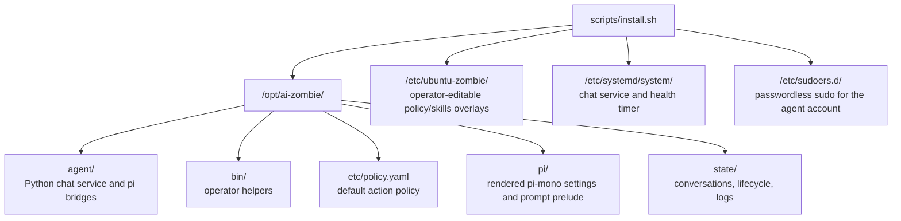

# Architecture

Ubuntu AI System Administrator is a local-only AI Systems Administrator for Ubuntu
Desktop LTS. The installer creates a dedicated Linux account, installs a
small Python chat service, renders pi-mono runtime configuration, and
runs everything behind a local policy gate and audit log.

## Installed shape



The default install does **not** provision SSH, Tailscale, VNC, Docker,
graphical autologin, or GUI automation. The baseline product access
surface is the chat service on
`127.0.0.1:${ZOMBIE_CHAT_PORT:-7878}`.

## Runtime components

- `server.py` serves the chat UI, session APIs, approval flow, health
  endpoints, model selection endpoints, and the authenticated
  server-sent-events stream used for live turn progress.
- `pi_mono.py` starts `pi-mono-bridge.mjs`, enforces turn timeouts, and
  returns structured events to the server. Optional bridge `token` and
  `progress` events are forwarded as live UI hints; the final persisted
  conversation remains authoritative.
- `tools.py` defines the closed tool registry: shell, filesystem,
  package, service, network status, skill loading, and the bounded
  `timer.reactivation` tool.
- `policy.py` classifies commands and tool calls before execution.
- `audit.py` writes JSON-lines audit records with secret redaction.
- `history.py` persists conversations, tool events, and the single pending
  reactivation timer in SQLite.
- `lifecycle.py` enforces the Time to Live state.

## Trust boundaries

1. The browser talks to the loopback chat service.
2. The server sends prompts to the configured LLM provider through
   pi-mono.
3. Proposed tool calls pass through schema validation and policy
   classification.
4. Elevated actions require the configured approval path before running.
5. Every decision and tool result is audit-logged.

The local agent account has passwordless sudo by design. The policy gate
and audit trail are the runtime safety boundary; they do not make the
agent account unprivileged.

## Chat turn transport

The browser normally asks `POST /api/message` for a streaming turn. The
server validates the prompt and TTL, registers an opaque `turn_id`, starts
the model turn in a worker thread, and returns immediately. The browser
then opens `GET /api/stream/{turn_id}` with `EventSource`; the endpoint is
behind the same session-cookie gate as the JSON APIs and is not public.

The stream is one-way SSE over the existing loopback `ThreadingHTTPServer`
and carries a small vocabulary:

| Event | Purpose |
| ----- | ------- |
| `phase` | Coarse turn state such as model work or finalising. |
| `token` | Best-effort assistant text deltas from the bridge. |
| `tool_start` / `tool_end` | Live tool activity from the same paths that write history/audit records, or display-only pi built-in tool progress. |
| `pending_approval` | An elevated call has entered the operator approval queue. |
| `turn_done` | The exact final JSON payload the synchronous path returns. |
| `turn_error` | Provider, bridge, TTL, or stream setup failure. |

Clients that omit `stream: true`, lack `EventSource`, or lose the stream
fall back to the original synchronous JSON response or a conversation
reload. Closing the stream does not cancel the server-side turn; history
and the audit log continue to be written and can be reloaded later.

## Tool policy

Action classes are:

| Class | Meaning |
| ----- | ------- |
| `read_only` | Inspection only; can auto-run. |
| `chat_schedule` | Bounded scheduling of one visible future chat turn; can auto-run. |
| `user_change` | Changes within user-owned state. |
| `system_change` | Package, service, or privileged file mutation. |
| `network_change` | Firewall or interface mutation. |
| `destructive` | Irreversible actions; requires the confirmation phrase. |

Built-in skills ship under `/opt/ai-zombie/skills/` and cover Ubuntu system
administration, diagnostics, development, data, networking, security, and
Ubuntu AI System Administrator itself. Each brief steers the model toward the correct typed
tool and names the policy class the operator is about to be asked to approve;
skills never expand the tool registry. Trigger words are unique across the
built-in catalogue so a prompt loads only the briefs that apply. Operators may
add local skill briefs under `/etc/ubuntu-zombie/skills.d/`.

Chat `/locals` discovery can find existing OpenAI-compatible LLM servers on
loopback and the local network. Discovery only configures Ubuntu AI System Administrator to use
a server; the installer does not provision a model server.

## Agent reactivation

`timer.reactivation` lets pi schedule one future continuation in the same
conversation. The server stores a single global pending timer in
`conversations.db`; a new request must explicitly replace the existing one.
Structured agent requests are stripped from the visible reply wherever they
appear (the last one wins), validated against the closed tool schema and
`chat_schedule` policy class, then dispatched to the timer runtime.
A server-owned timer thread re-reads the durable record after each sleep,
skips conversations that already have a turn in flight, atomically claims a due
record, checks the TTL and conversation, and starts an ordinary turn with fresh
policy decisions. It never executes a tool directly or carries an approval into
the new turn.

The authenticated UI polls the pending state, shows its reason, prompt preview,
and fire time, and gives the operator a cancel control. The injected user
message is marked `auto_reactivation` in history and rendered as queued by the
timer. Scheduling, replacement, cancellation, deferral, firing, chain depth,
and failure are written to the audit log; a continuation the daemon refuses to
run also appears in the transcript and in the last-outcome report returned by
`/api/reactivation`.

The operator can reset this mechanism with `/reactivation reset`. The reset
atomically restores the default enabled state and delay bounds, retires the
queued timer, requests cancellation of any active continuation, and advances a
durable reset timestamp so pre-reset outcomes and chain counts do not leak into
the current UX. Historical timer rows and audit evidence are retained.

## Installer command grammar

```text
scripts/install.sh [verb] [flags]
```

| Verb | Behaviour |
| ---- | --------- |
| `install` | Idempotently install Ubuntu AI System Administrator. |
| `verify` | Read-only state check. |
| `doctor` | Explain failures and likely fixes. |
| `repair` | Re-assert permissions, re-render runtime config, redeploy skills, restart chat. |
| `uninstall` | Delegate to `scripts/uninstall.sh` and remove Ubuntu AI System Administrator. |

## Logs and state

| Path | Purpose |
| ---- | ------- |
| `/var/log/ubuntu-zombie-install.log` | Installer transcript. |
| `/var/log/ubuntu-zombie/install-receipt.txt` | Non-secret install receipt. |
| `/var/log/ubuntu-zombie/audit.log` | JSON-lines audit trail. |
| `/opt/ai-zombie/state/conversations.db` | Chat history. |
| `/opt/ai-zombie/state/lifecycle.json` | TTL/tombstone state. |
| `/opt/ai-zombie/state/logs/` | pi-mono bridge logs. |
